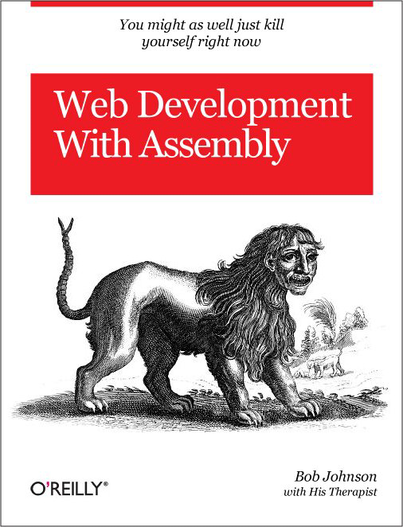

<!SLIDE>

# Recommendations

*What, you think we aren't opinionated?*

<!SLIDE>

# Add a License

  

<!SLIDE bullets >
 
# Add a License

* Avoid legal concerns for contributors
* In general people are good at attribution

<!SLIDE bullet>

# GPLv2

* **Can:** Commercial Use, Modify, Distribute, Place Warranty 
* **Cannot:** Sublicense, Hold Liable 
* **Must:** Include Original, Disclose Source 

*<small>source: tldrlegal.com</small>*

<!SLIDE>

# GPLv3

* **Can:** Commercial Use, Modify, Distribute, Place Warranty 
* **Cannot:** Sublicense, Hold Liable 
* **Must:** Include Original, Disclose Source, *State Changes*

*<small>source: tldrlegal.com</small>*

<!SLIDE>

# MIT
* **Can:** Commercial Use, Modify, Distribute, Sublicense 
* **Cannot:** Hold Liable 
* **Must:** Include Copyright 

*<small>source: tldrlegal.com</small>*

<!SLIDE>

# BSD
* **Can:** Commercial Use, Modify, Distribute, Sublicense, Place Warranty 
* **Cannot:** Use Trademark, Hold Liable
* **Must:** Include Copyright 

*<small>source: tldrlegal.com</small>*

<!SLIDE bullet>

# Other Licenses

* Consider how it'll impact contributors
* Consider how it'll affect companies
* Questions? http://tldrlegal.com
  * ***Note:*** *not a replacement for an actual lawyer... and neither are we...*

<!SLIDE>

# Use Version Control

<!SLIDE>
# Use *Public* Version Control

* Github is awesome
* Acts as public changelog
* Public repos can build excitement
* Requires zero maintenance to keep the project around forever

<!SLIDE>

# Readable Code == Maintainable Code

<!SLIDE>

# Code Quality

<!SLIDE>

# Comment Your Code

<!SLIDE>

# Consumable Outputs

<!SLIDE>

# Package for the Community

<!SLIDE>

# Don't reinvent the wheel

* Open PRs to existing projects or fork the project 
* **Note: this only works if people make their code accessible to the community**

<!SLIDE>
# Bottom Line

* [Hackers] - [Coders] != []
* Set up your scripts as an Open Source project and you are more likely to get the help you need and your project deserves. 

