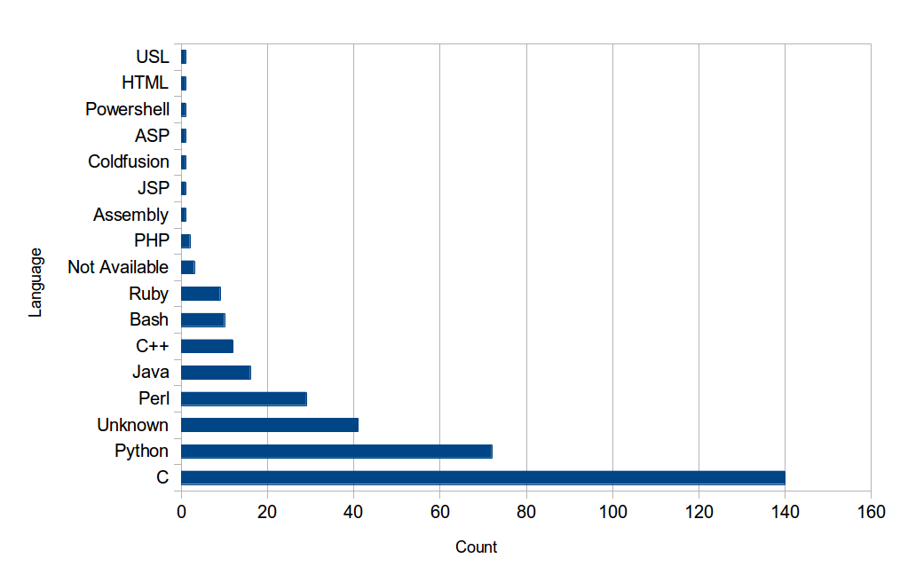
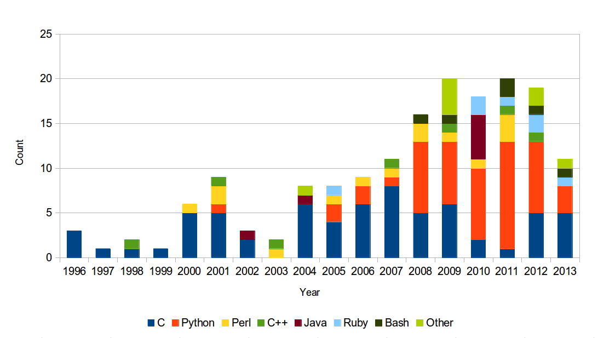
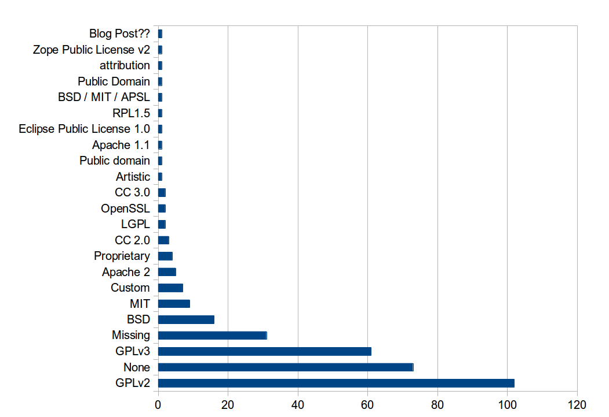

```
__________                    _____  .__  .__      __  .__             ___________.__    .__                      
\______   \__  _  ______     /  _  \ |  | |  |   _/  |_|  |__   ____   \__    ___/|  |__ |__| ____    ____  ______
 |     ___/\ \/ \/ /    \   /  /_\  \|  | |  |   \   __\  |  \_/ __ \    |    |   |  |  \|  |/    \  / ___\/  ___/
 |    |     \     /   |  \ /    |    \  |_|  |__  |  | |   Y  \  ___/    |    |   |   Y  \  |   |  \/ /_/  >___ \ 
 |____|      \/\_/|___|  / \____|__  /____/____/  |__| |___|  /\___  >   |____|   |___|  /__|___|  /\___  /____  >
                       \/          \/                       \/     \/                  \/       \//_____/     \/ 
```

### State of the modern penetration testing toolkit

Sam Stelfox
===========

* Email: sam@pwnieexpress.com
* Twitter: @SamStelfox 
* Website: http://stelfox.net

Gabe Koss
=========

* Email: gabe@pwnieexpress.com
* Twitter: @granolocks 
* Website: http://gabekoss.com

Pwnie Express
=============

* Twitter: @pwnieexpress 
* Website: https://pwnieexpress.com

Goals
=====

* Understand the tools we depend on
* Evaluate the state of the open source side of our toolkits
* Gather relevant metrics about the tools
  * Software License
  * Language Used
  * Revision Control
  * Project Activity
  * Project Age
  * Overlapping Functionality
  * Package
  * Overall Code Quality

What This Talk is Not
=====================

* A new tool release
* How to hack a...
* Marketing

Research Sources
================

* Kali Repositories
* Google
* Wikipedia
* Github
* Source Forge
* Google Code
* IRC
* Various Other Websites
* Blind Faith
* Luck

### Other Shoutouts

* Pentoo
* BlackArch

Research Caveats
================

* Relatively Unscientific 
* Done by hand
* Time constraints

The Tools
=========

* The Good
* The Bad
* The Unusable

First, the Best
==============

* Aircrack
* Armitage
* Burp Suite
* Kismet
* Maltego
* Metasploit
* Nmap
* SET
* Wireshark
* &c. 

*We completely ignored these...*

Disclaimer
==========

*We aren't trying to pick on anyone.*

Automater
=========

Creepy
======

DHCPig
======

Fierce
======

p0f
===

Wifi Honey
==========

Xprobe2
======

Stats
=====

*Numbers yo...*

Project Activity
================

* Shortest Project Length (days): 0
* Average Project Length (days): 1425
* Median Project Length (days): 840
* Longest Project Length (days): 6518

Languages
=========



Base Language by Year
=====================



Code Quality
============

* follow community best practices
* read a style guide
* test coverage where possible

Licenses
========

* Important!
* Good coders want to work on software with good licenses
* We need to improve on this front too

Licenses
========




Licenses
========


Licenses: GPL
==============

Licenses: MIT
==============

Licenses: BSD
==============

Licenses: Others
================

* http://tldrlegal.com (*not a replacement for an actualy lawyer*)


Revision Control
================

...

Recommendations
===============

*What, you think we aren't opinionated?*

Add a License
=============

* Use MIT or GPLv3 if you want people to continue your work
* Avoids legal concerns for people to integrate your tools
* In general people are pretty good about attribution

Use Version Control
===================

* Github is awesome
* Acts as a changelog


Readable Code == Maintainable Code
==================================

Naming Your Project / Functions
===============================

Comment Your Code
=================

Consumable Data
===============

```
./my_sexy_tool | grep some_dirty_steez
```

* How will people use your data?
* What other tools would it be well suited to?
* Are there existing formats or standards to represent the data you are providing?


Package for the Community
=========================

* You get to do a tool release!
* You get to standardize how your tool should be shipped and deal with dependency management.

Don't reinvent the wheel
========================

* Open PRs to existing projects or fork the project 
* **Note: this only works if people make their code accessible to the community**

Bottom Line
===========

* [Hackers] - [Coders] != []
* Set up your scripts as an Open Source project and you are more likely to get the help you need and your project deserves. 

Other Resources
===============

* Darpa Tool List
  * http://www.darpa.mil/opencatalog/
* Sec Tools
  * http://sectools.org/
* Probably the Best Free Security Tool List in the World
  * http://www.techsupportalert.com/content/probably-best-free-security-list-world.htm

Q & A
=====

```
░wow░░░░░▄░░░░░░░░░░░░░░▄░░░░
░░░░░░░░▌▒█░░░░░░░░░░░▄▀▒▌░░░
░░░░░░░░▌▒▒█░░░░░░░░▄▀▒▒▒▐░░░
░░░░░░░▐▄▀▒▒▀▀▀▀▄▄▄▀▒▒▒many░░
░░░░░▄▄▀▒░▒▒▒▒▒▒▒▒▒█ideas▐░░░
░░░▄▀▒▒▒░░░▒▒▒░░░▒▒▒▀██▀▒▌░░░ 
░░▐▒▒▒▄▄▒▒▒▒░░░▒▒▒▒▒▒▒▀▄▒▒▌░░
░░▌░░▌█▀▒▒▒▒▒▄▀█▄▒▒▒▒▒▒▒█▒▐░░
░▐░░░▒▒▒▒▒▒▒▒▌██▀▒▒░░░▒▒▒▀▄▌░
░▌░▒▄██▄▒▒▒▒▒▒▒▒▒░░░░░░▒▒▒▒▌░
▀▒▀▐▄█▄█▌▄░▀▒▒░░░░░░░░░░▒▒▒▐░
▐▒▒▐▀▐▀▒░▄▄▒▄▒▒▒▒▒▒░▒░▒░▒▒▒▒▌
▐▒▒▒▀▀▄▄▒▒▒▄▒▒▒▒▒▒▒▒░▒░▒░▒▒▐░
░▌▒▒▒▒▒▒▀▀▀▒▒▒▒▒▒░▒░▒░▒░▒▒▒▌░
░▐▒▒▒▒▒▒▒▒▒▒▒▒▒▒░▒░▒░▒▒▄▒▒▐░░
░░▀▄▒▒▒▒▒▒▒▒▒▒▒░▒░▒░such▒▒▌░░
░░░░▀▄▒▒▒▒▒▒▒▒▒▒▄▄questions░░
░░░░░░▀▄▄▄▄▄▄▀▀▀▒▒▒▒▒▄▄▀░░░░░
░░░░░░░░░▒▒▒▒▒▒▒▒▒▒▀▀░░░░░░░░
```
